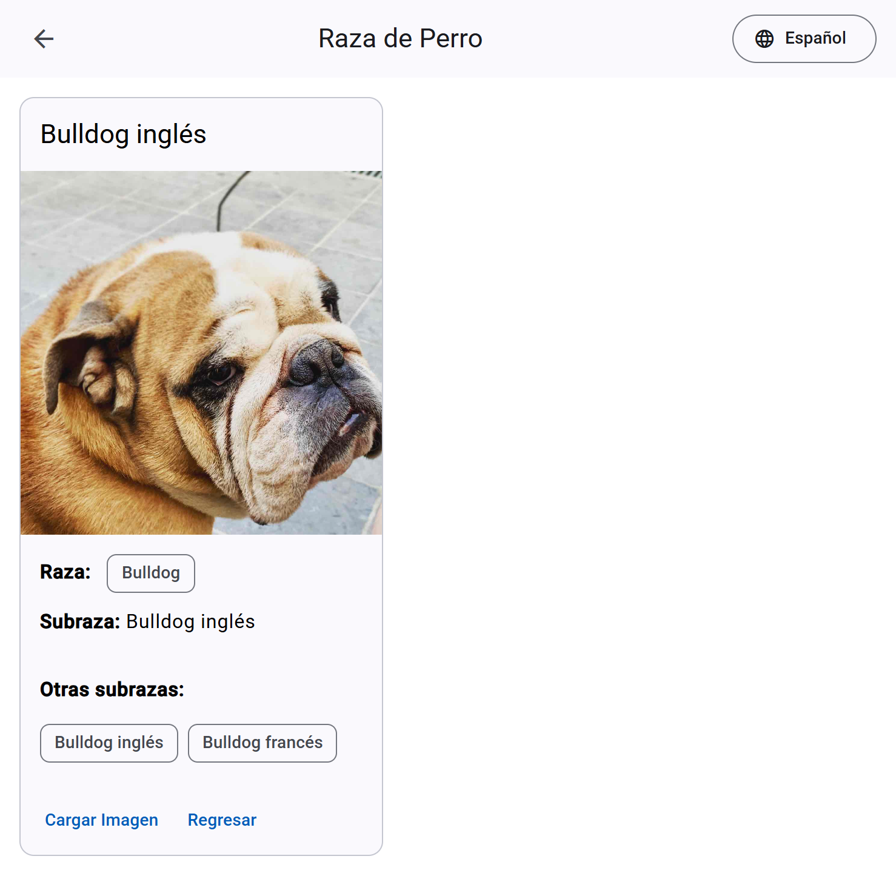

# Dog Breed

*Leer esto en [Inglés](README.md)*

Una aplicación Angular para buscar razas y subrazas de perros y mostrar sus imágenes.



## 📝 Descripción

Esta aplicación fue desarrollada como solución para una prueba técnica utilizando la [Dog API](https://dog.ceo/dog-api/). La aplicación permite buscar razas y subrazas de perros y visualizar sus imágenes de manera dinámica e intuitiva.

## 🔗 Demo en vivo

Puedes probar la aplicación en funcionamiento aquí: [https://luisenriquevegamartinez.github.io/DogBreed](https://luisenriquevegamartinez.github.io/DogBreed)

## ✨ Características principales

- **Búsqueda dinámica**: Permite buscar razas y subrazas de perros en tiempo real mientras el usuario escribe
- **Interfaz de usuario moderna**: Diseño limpio e intuitivo usando Angular Material
- **Responsive design**: Funciona en dispositivos móviles y de escritorio
- **Internacionalización**: Soporte para múltiples idiomas
- **Cobertura de pruebas al 100%**: Todas las funcionalidades están probadas con tests unitarios

## 🛠️ Tecnologías utilizadas

- Angular 18
- Angular Material
- RxJS
- @ngx-translate para internacionalización
- Conventional Commits
- Husky para git hooks
- ESLint para linting
- Karma y Jasmine para testing

## 📋 Requerimientos cumplidos

1. ✅ **API de perros**: Integración completa con la API de [Dog.ceo](https://dog.ceo/dog-api/)
2. ✅ **Angular 16+**: Desarrollado con Angular 18
3. ✅ **Angular Material**: Utilizado para la interfaz de usuario
4. ✅ **Repositorio público**: Código disponible en GitHub
5. ✅ **Hosting público**: Desplegado en GitHub Pages

## 🌟 Características adicionales implementadas

1. **Organización de commits**: Se utilizó Conventional Commits para mantener un histórico de cambios claro y semántico
2. **Internacionalización**: Soporte para múltiples idiomas mediante @ngx-translate
3. **Testing al 100%**: Cobertura total de pruebas unitarias
4. **Integración continua**: Configuración para prevenir commits si las pruebas fallan
5. **Despliegue automatizado**: Configuración para desplegar fácilmente a GitHub Pages

## 🚀 Instalación y ejecución

### Prerrequisitos

- Node.js (versión 18 o superior)
- npm (versión 8 o superior)

### Instalación

```bash
# Clonar el repositorio
git clone https://github.com/luisenriquevegamartinez/DogBreed.git

# Cambiar al directorio del proyecto
cd DogBreed

# Instalar dependencias
npm install
```

### Ejecución en modo desarrollo

```bash
npm start
```

Navega a `http://localhost:4200/`. La aplicación se recargará automáticamente si cambias alguno de los archivos fuente.

### Construir para producción

```bash
npm run build
```

Los artefactos de construcción se almacenarán en el directorio `dist/`.

### Desplegar en GitHub Pages

```bash
npm run deploy
```

## 🧪 Pruebas unitarias

### Ejecutar pruebas unitarias

```bash
npm test
```

### Ejecutar pruebas en modo CI

```bash
npm run test:ci
```

## 📝 Convenciones de código

Este proyecto utiliza:

- **ESLint**: Para asegurar la calidad del código
- **Conventional Commits**: Para mantener un historial de commits limpio y semántico
- **Husky**: Para ejecutar verificaciones antes de cada commit

## 🌐 Internacionalización

La aplicación soporta múltiples idiomas a través de @ngx-translate. Actualmente están disponibles:

- Español 🇪🇸
- Inglés 🇺🇸

## 👨‍💻 Autor

[Luis Enrique Vega Martinez](https://github.com/luisenriquevegamartinez)

## 📄 Licencia

Este proyecto está licenciado bajo la Licencia MIT - ver el archivo [LICENSE.md](LICENSE.md) para más detalles.
