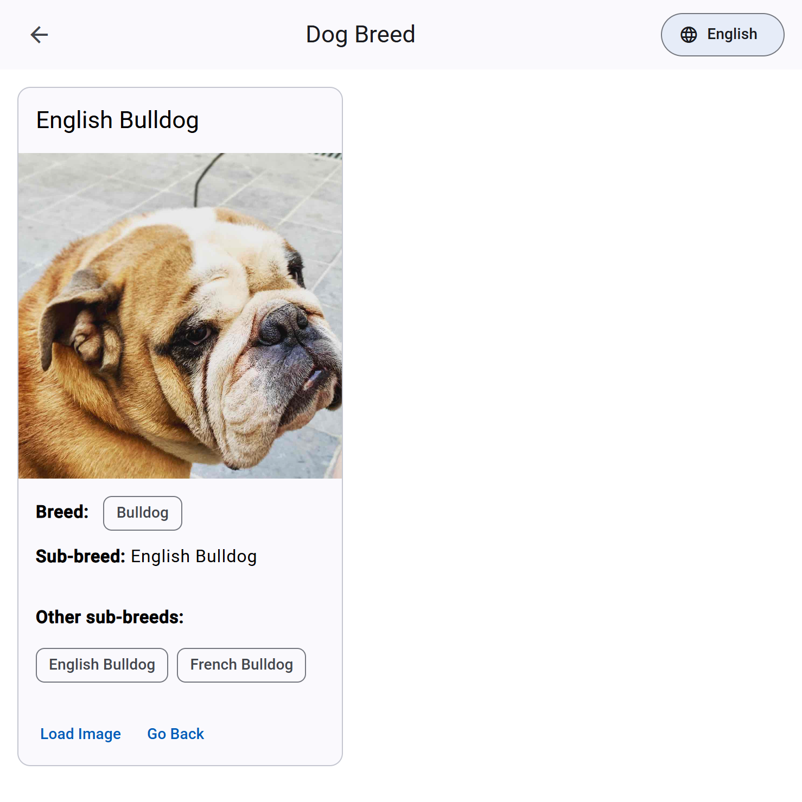

# Dog Breed

*Read this in [Spanish](README.es.md)*

An Angular application to search for dog breeds and sub-breeds and display their images.



## 📝 Description

This application was developed as a solution for a technical test using the [Dog API](https://dog.ceo/dog-api/). The app allows users to search for dog breeds and sub-breeds and dynamically view their images in an intuitive interface.

## 🔗 Live Demo

You can try the working application here: [https://luisenriquevegamartinez.github.io/DogBreed](https://luisenriquevegamartinez.github.io/DogBreed)

## ✨ Key Features

- **Dynamic Search**: Search for dog breeds and sub-breeds in real-time as you type
- **Modern UI**: Clean and intuitive design using Angular Material
- **Responsive Design**: Works on both mobile and desktop devices
- **Internationalization**: Support for multiple languages
- **100% Test Coverage**: All functionality is covered by unit tests

## 🛠️ Technologies Used

- Angular 18
- Angular Material
- RxJS
- @ngx-translate for internationalization
- Conventional Commits
- Husky for git hooks
- ESLint for linting
- Karma and Jasmine for testing

## 📋 Requirements Fulfilled

1. ✅ **Dog API Integration**: Complete integration with [Dog.ceo](https://dog.ceo/dog-api/) API
2. ✅ **Angular 16+**: Developed with Angular 18
3. ✅ **Angular Material**: Used for UI components
4. ✅ **Public Repository**: Code available on GitHub
5. ✅ **Public Hosting**: Deployed on GitHub Pages

## 🌟 Additional Features Implemented

1. **Commit Organization**: Used Conventional Commits for a clear and semantic change history
2. **Internationalization**: Support for multiple languages using @ngx-translate
3. **100% Test Coverage**: Complete unit test coverage
4. **Continuous Integration**: Configuration to prevent commits if tests fail
5. **Automated Deployment**: Easy deployment to GitHub Pages

## 🚀 Installation and Execution

### Prerequisites

- Node.js (version 18 or higher)
- npm (version 8 or higher)

### Installation

```bash
# Clone the repository
git clone https://github.com/luisenriquevegamartinez/DogBreed.git

# Change to the project directory
cd DogBreed

# Install dependencies
npm install
```

### Running in development mode

```bash
npm start
```

Navigate to `http://localhost:4200/`. The application will automatically reload if you change any of the source files.

### Building for production

```bash
npm run build
```

Build artifacts will be stored in the `dist/` directory.

### Deploying to GitHub Pages

```bash
npm run deploy
```

## 🧪 Unit Tests

### Running unit tests

```bash
npm test
```

### Running tests in CI mode

```bash
npm run test:ci
```

## 📝 Code Conventions

This project uses:

- **ESLint**: To ensure code quality
- **Conventional Commits**: To maintain a clean and semantic commit history
- **Husky**: To run checks before each commit

## 🌐 Internationalization

The application supports multiple languages through @ngx-translate. Currently available:

- Spanish 🇪🇸
- English 🇺🇸

## 👨‍💻 Author

[Luis Enrique Vega Martinez](https://github.com/luisenriquevegamartinez)

## 📄 License

This project is licensed under the MIT License - see the [LICENSE.md](LICENSE.md) file for details.
